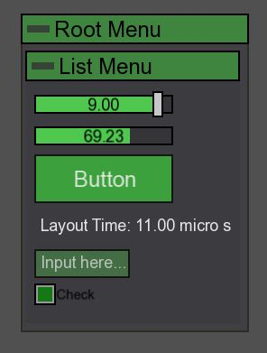

# SFML GUI Library

This is a lightweight and extensible GUI (Graphical User Interface) library built with C++ and [SFML (Simple and Fast Multimedia Library)](https://www.sfml-dev.org/). Designed to provide reusable UI components such as buttons, sliders, panels, and more, with a intuitive styling and layout management!




## Features

- Easy-to-use widget system
- Mouse and keyboard input handling
- Custom styling (colors, fonts, textures)
- Flexible layout system (containers, alignment)
- Event-driven architecture
- Dynamic fully automatic layout management
- Variable bounding & callBack support
- Minimal dependencies (only SFML)


## Requirements

- C++17 or higher
- SFML 2.6.2 or later

## Getting Started

### 1. Clone the Repository

```bash
git clone https://github.com/yourusername/sfml-gui-library.git
cd sfml-gui-library
```

### 2. Build the project

```bash
mkdir build
cd build
cmake ..
make
```

### 3. Integrate into your project
```
#include "UILibrary.hpp"`
```

Example usage in folder "test samples"
